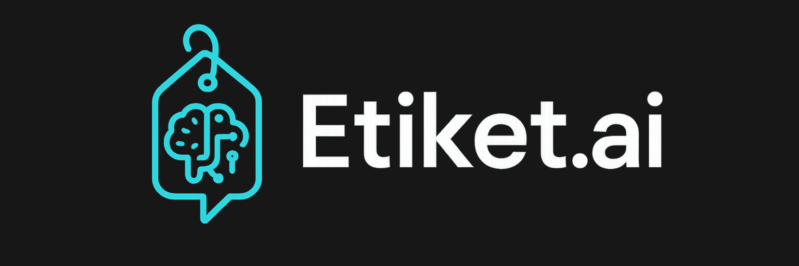

# Etiket.ai: Yapay Zeka Destekli Otomatik Ürün Açıklaması Oluşturucu

**Slogan:** Zahmetsiz E-ticaret. Yapay zeka ile oluşturulmuş açıklamalar ve 7/24 ürün asistanı ile satışlarınızı artırın.

## ❓ Sunum: Bunu Neden Yaptık?

### Problem

Günümüzün e-ticaret ortamı oldukça rekabetçi. Bir satıcının öne çıkması için iki şeye ihtiyacı vardır: arama motorlarında üst sıralarda yer alacak etkileyici ürün açıklamaları ve alıcıların sorularını anında yanıtlayan üstün müşteri hizmetleri.

Ancak, ikna edici, SEO uyumlu açıklamalar oluşturmak zaman alıcı ve genellikle zor bir iştir. Dahası, çok sayıda tekrarlayan müşteri sorusu, satıcıları bunaltabilir, bu da kötü bir müşteri deneyimine ve kaçırılan satışlara yol açar.

### Çözümümüz

Bu temel e-ticaret sorunlarını çözmek için yapay zekanın gücünden yararlanan akıllı bir platform oluşturduk. Çözümümüz, yüksek kaliteli ürün açıklamalarının oluşturulmasını otomatikleştiriyor ve anında, yapay zeka destekli bir ürün asistanı sağlıyor. Bu sayede satıcıların zamandan tasarruf etmesini ve alıcı deneyimini önemli ölçüde artırmasını sağlıyor.

## 🛍️ Hikaye: Satıcıdan Alıcıya Bir Yolculuk

Bu sadece bir araç değil; iş yapmanın yeni bir yolu. Gelin hem satıcı hem de alıcı tarafındaki deneyimi inceleyelim:

### Satıcının Deneyimi

1.  **Yeni Ürün, Minimum Çaba:** Bir satıcı, listelemek istediği yeni bir ürüne sahiptir. Platformumuza giriş yapar ve temel bilgileri girer: ürün adı, kategori ve birkaç açıklayıcı anahtar kelime (örneğin, "Kablosuz Kulaklık," "Gürültü Engelleme," "Uzun Pil Ömrü").

2.  **Sihirli Düğme:** "Açıklama Oluştur" düğmesine tek bir tıklama ile sistemimiz bu minimal bilgiyi Gemini API'ye gönderir.

3.  **Anında İçerik:** Saniyeler içinde, ikna edici ve SEO dostu bir ürün açıklaması belirir. Bu sadece bir metin bloğu değil; arama motorları ve potansiyel alıcılar için tasarlanmış ikna edici bir anlatıdır.

4.  **Akıllı Destek Oluşturma:** Açıklamayı kaydettikten sonra, satıcıdan sıkça sorulan soruların (SSS) bir listesini yüklemesi istenir. Bu, güçlü bir destek aracı oluşturmak için çok önemli bir adımdır ve ürün sayfasını müşteri etkileşimi için hazırlar.

### Alıcının Deneyimi

1.  **Bir Soru Ortaya Çıkar:** Potansiyel bir alıcı ürün sayfasına gider. Kulaklığın pil ömrü hakkında bir sorusu vardır. Açıklamayı aramak veya yanıt beklemek yerine, sohbet robotu simgesine tıklar.

2.  **Anında, Doğru Yanıtlar:** Alıcı, "Pil ömrü ne kadar?" diye sorar. RAG ile desteklenen yapay zeka asistanımız, satıcının SSS'lerinden ve ürün detaylarından ilgili bilgileri anında alır ve gerçek zamanlı olarak doğru ve faydalı bir yanıt verir.

## ⚙️ Teknik Detaylar: "Nasıl" Yaptık?

Projemiz, modern ve verimli bir teknoloji yığınının gücünün bir kanıtıdır.

### 💻 Mimari ve Teknoloji Yığını (Tech Stack)

* **Ön Uç ve Arka Uç (Full-Stack):** 
  * Projemizin ön ve arka ucu için **Next.js**'i bir full-stack framework olarak kullandık. Bu sayede, hem kullanıcı arayüzü hem de veri işleme mantığını tek bir kod tabanında yönetebildik, bu da geliştirme sürecini hızlandırdı ve yönetimi kolaylaştırdı.

  * **TypeScript** kullanımı ise projemize statik tip denetimi ekleyerek kod kalitemizi artırdı, olası hataları en aza indirdi ve özellikle ekip çalışması için daha güvenilir bir temel oluşturdu. Bu, projenin sadece işlevsel değil, aynı zamanda sağlam ve sürdürülebilir olduğunu gösterir.

* **Yapay Zeka Motoru (Beyin):**

    * **Ürün Açıklaması Oluşturma:** Yüksek kaliteli ürün açıklamaları oluşturmak için **Gemini API** ile entegre olduk. Bu, yaratıcılık ve içerik optimizasyonu için en son teknolojiye sahip dil modeli olan **Gemini 2.5 Flash** kullanmamızı sağladı.

    * **Yapay Zeka Sohbet Robotu:** Sohbet robotu, gerçek zamanlı konuşma yapay zekası için mükemmel olan, yüksek hızlı ve uygun maliyetli bir model olan **Gemini 2.5 Flash** tarafından desteklenmektedir.

* **Veri ve Hafıza (Kalp):**

    * **Veritabanı:** Veritabanı olarak MongoDB Atlas'ı seçmemizin temelinde, projemizin hem bugünkü ihtiyaçlarını karşılamak hem de gelecekteki büyüme potansiyelini desteklemek yatıyor. MongoDB'nin esnek belge modeli, hem yapılandırılmış ürün verilerimizi hem de RAG için gerekli olan yapılandırılmamış vector embedding verilerini tek ve ölçeklenebilir bir konumda depolamak için mükemmel bir uyum sağladı.
    * Projemizin MVP (Minimum Viable Product) aşaması için ise MongoDB Atlas'ın cömert ücretsiz paketi büyük bir avantaj sundu. Bu paket bize 512 MB depolama alanı ve 3 adede kadar Vector Search indeksi oluşturma imkanı tanıyor. Bu sayede, ürünümüzün erken aşamalarındaki maliyetlerini sıfıra indirerek projeye hızlıca odaklanabildik.

    * **RAG Pipeline:** **Retrieval-Augmented Generation (RAG)**, sohbet robotumuzun zekasının merkezinde yer alır.

        1.  **Veri Alma:** Bir satıcı ürünle ilgili sıkça sorulan soruları (SSS) yüklediğinde, metni sayısal vektörlere dönüştürmek için Gemini'ın **text-embedding-004** vector embedding modelini kullanırız.

        2.  **Depolama:** Bu vektörler, MongoDB Atlas veritabanımızdaki ürün verilerinin yanında depolanır.

        3.  **Erişim:** Bir alıcı bir soru sorduğunda, sorgusunu bir vektöre dönüştürür, veritabanımızdaki en benzer vektörleri arar ve karşılık gelen orijinal SSS metnini alırız.

        4.  **Oluşturma:** Alınan bu bilgilere dayalı bağlam, kullanıcının sorusuyla birlikte **Gemini 2.5 Flash** dil modeline verilir. Bu, yapay zekanın yanıtının satıcının belirli ürün bilgisine dayandığından emin olur ve halüsinasyon gibi yaygın sorunları ortadan kaldırır.

## 🎯 İş Etkisi ve Pazar Potansiyeli

Bu proje sadece bir prototip değil; net bir değere sahip, pazarlanabilir bir çözümdür.

* **Satıcılar İçin:** Ürün listeleme için gereken zaman ve çabayı önemli ölçüde azaltır, ürün sayfası SEO'sunu iyileştirir ve yaygın soruları otomatikleştirerek müşteri desteği yükünü azaltır.

* **Alıcılar İçin:** Sorulara anında, doğru yanıtlar verir, bu da daha bilinçli satın alma kararlarına ve daha iyi bir genel alışveriş deneyimine yol açar.

* **Gelecek Vizyonu:** Platformu, otomatik resim etiketleme, uluslararası satıcılar için çok dilli destek ve gelişmiş SEO analizi ve pazarlama araçları gibi özellikler içerecek şekilde genişletmeyi planlıyoruz.

### 🗺️ Gelecek Yol Haritası

Bu proje, daha büyük bir vizyonun ilk adımıdır. Bu prototipi tam teşekküllü bir platforma dönüştürmek için net bir yol haritamız var:

* **Kısa Vadeli Hedefler (Hackathon Sonrası):**

    * Hedef: Ürün kullanma kılavuzu yükleme özelliği geliştirmek.

      * Strateji: Satıcıların ürünlerine ait kullanma kılavuzlarını veya teknik dökümanlarını yükleyebilecekleri bir arayüz oluşturmak. Bu dökümanlardaki bilgileri, sohbet botunun veri setine ekleyerek, daha detaylı ve doğru yanıtlar vermesini sağlamak.

    * Hedef: Fiyatlandırma ve abonelik modelini belirlemek.

      * Strateji: Rakiplerin fiyatlandırma modellerini analiz ederek, özellikle küçük ve orta ölçekli işletmeler için cazip olacak, esnek ve rekabetçi bir fiyatlandırma stratejisi oluşturmak.

    * Hedef: Satıcıların geri bildirimlerini toplamak ve ürünü iyileştirmek.

        * Strateji: Erken kullanıcıların geri bildirimlerini toplayarak ürün açıklaması oluşturma ve sohbet robotu özelliklerini geliştirmek, böylece benzersiz bir kullanıcı deneyimi sunmak.

* **Orta Vadeli Hedefler:**

    * Hedef: Niş pazarlara yönelik özel özellikler geliştirmek.

      * Strateji: Farklı sektörlerdeki (örneğin moda, teknoloji, el yapımı ürünler) satıcıların özel ihtiyaçlarına yönelik, özelleştirilmiş ürün açıklamaları ve SSS oluşturma şablonları sunmak.

    * Hedef: Yapay zeka destekli ek özellikler eklemek.

      * Strateji: Metin oluşturma yeteneklerinin yanı sıra, ürün resimlerini otomatik olarak etiketleme ve potansiyel alıcılara kişiselleştirilmiş ürün önerileri sunma gibi yapay zeka özelliklerini entegre etmek.
  
    * Hedef: Satıcılar için basit bir analiz paneli eklemek.

      * Strateji: Satıcıların en popüler ürün açıklamalarını, en çok sorulan SSS'leri ve sohbet robotunun yanıt verme performansını takip edebileceği bir gösterge tablosu oluşturmak.

* **Uzun Vadeli Hedefler:**

    * Hedef: Kapsamlı bir e-ticaret yönetim aracına dönüşmek.

      * Strateji: Envanter veya sipariş takibi gibi karmaşık sistemleri sıfırdan geliştirmek yerine, Shopify ve WooCommerce gibi mevcut popüler e-ticaret platformlarıyla entegrasyonlar kurarak satıcıların mevcut iş akışlarına sorunsuz bir şekilde entegre olacağız.
    
    * Hedef: Kullanıcı topluluğunu oluşturmak.

      * Strateji: Satıcıların deneyimlerini, en iyi uygulamalarını ve pazarlama stratejilerini paylaşabileceği bir forum veya topluluk platformu oluşturarak kullanıcı bağlılığını artırmak.

    * Hedef: Çok dilli destek ile küresel pazarlara açılmak.

        * Strateji: Başlangıçta tüm dilleri desteklemek yerine, en çok potansiyel barındıran birkaç dil (örneğin İngilizce, İspanyolca ve Almanca) ile başlamak. Bu, pazar araştırmanıza göre belirlenecek öncelikli pazarlara odaklanmanızı sağlar.

    * Hedef: Gelişmiş pazarlama ve SEO analizi özellikleri eklemek.

      * Strateji: Satıcıların ürün açıklamalarının SEO performansını takip etmelerini sağlayan basit analiz araçları sunmak. Hangi anahtar kelimelerin iyi performans gösterdiğini veya hangi ürün açıklamalarının daha fazla dönüşüm sağladığını gösteren raporlar oluşturmak. Bu özellik, ürününüzü sadece içerik oluşturucu bir araçtan daha fazlası haline getirecektir.

## 👫 Ekip ve Teşekkürler

* **Ekip Üyeleri:**

* **Teşekkürler:**

    * Bu harika fırsatı yarattıkları için hackathon organizatörlerine ve sponsorlarına minnettarız.

## ✨ Başlarken

### **Çalışırken Görün!**

* **Canlı Demo:** https://etiketai-ten.vercel.app/

* **GitHub Reposu:** https://github.com/ozge-demiryol/automatic-product-description.git

### **Yerel Olarak Çalıştırma**

1.  Repoyu klonlayın: `git clone https://github.com/ozge-demiryol/automatic-product-description.git`

2.  Proje dizinine gidin: `cd automatic-product-description`

3.  Bağımlılıkları yükleyin: `npm install`

4.  `GEMINI_API_KEY` ve `MONGODB_URI` içeren bir `.env` dosyası oluşturun.

5.  Geliştirme sunucusunu başlatın: `npm run dev`

6.  Tarayıcınızda `http://localhost:3000` adresini açın.